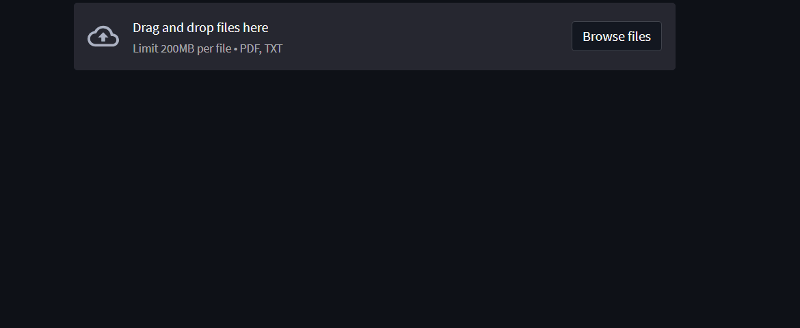

# 🧾 Salary Slip Analyzer Bot

A FinTech project that extracts structured insights from Indian salary slips (TXT or PDF) using regex, PDF parsing, and interactive visualization.  
Built with **Python**, **Streamlit**, **pdfplumber**, and **matplotlib**.

---

## 📌 Features

✅ Upload `.pdf` or `.txt` salary slips  
✅ Auto-extract: Employee info, earnings, deductions, net pay  
✅ Visualize earnings vs deductions  
✅ Download clean `.csv` of results  
✅ Simple drag-and-drop web interface (via Streamlit)

---

## 🧠 Project Overview

The Salary Slip Analyzer Bot is a data analysis tool for HR, FinTech, and payroll applications.  
It helps simplify and structure messy salary slips into clean, analyzable datasets with optional charts.

---

## 📂 Project Structure

salary-slip-analyzer-bot/
├── app.py # Streamlit web app
├── analyze_slip.py # CLI version (Python script)
├── samples/ # Demo salary slips (PDF/TXT)
│ └── sample_salary_slip.pdf
├── utils/
│ └── parser.py # Regex extraction logic
├── output/ # Extracted CSVs
├── README.md # Project documentation
├── requirements.txt # Python dependencies 

---

## 🚀 Installation

1. **Clone the repository**
git clone https://github.com/yourusername/salary-slip-analyzer-bot.git
cd salary-slip-analyzer-bot
Install required Python libraries

2. **Install required Python libraries**

pip install -r requirements.txt

▶️ Usage
Run the Web App (Streamlit)
streamlit run app.py

Or Run the CLI Script
python analyze_slip.py

## 📷 Demo

📤 Output Example
Extracted CSV file (`output/salary_slip_analyzed.csv`)
Employee Name,Employee ID,Designation,Department,Pay Period,Basic Pay,HRA,Conveyance,Special Allowance,PF,Professional Tax,TDS,Net Pay
Ajay Royal,12345,Data Analyst,Data Science,June 2025,30000,12000,1600,4400,3600,200,1500,42700

📦 Tech Stack
Python

Streamlit (UI)

pdfplumber (PDF parsing)

Regex (data extraction)

Pandas (dataframe output)

Matplotlib (charts)

🤝 Contributing
Pull requests and feedback are welcome! Feel free to fork this repo and submit PRs or open issues for enhancements.

📄 License
This project is licensed under the MIT License.
See the LICENSE file for more information.

---

## 🙋 Author

**Ajay Kumar Issa**  
🔗 [GitHub](https://github.com/Ajayroyal143)  
🔗 [LinkedIn](https://www.linkedin.com/in/ajay-kumar-issa-8058352a7/)
